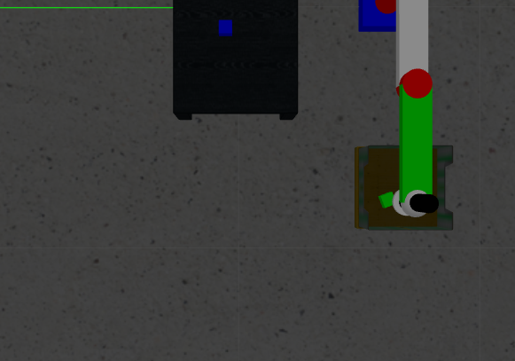
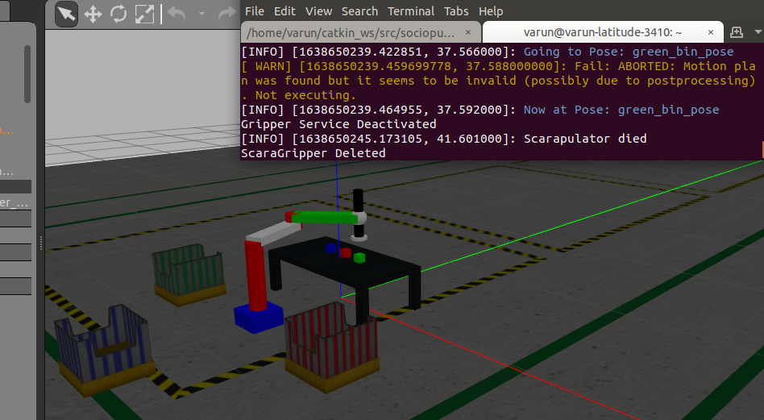

# Human-Robot team to overcome failures using speech based communication

**Author**: [Pratik Kumbhare](https://github.com/Pratik-94)   [Varun Walimbe](https://github.com/varun7860) 

## About 
This project proposes a human-robot team to perform a pick and place task by accounting for failures using the human's intuition. In this project the manipulator has the task of sorting the three packages (Green,Red,Blue) in their respective bin (Green - Green Bin, Red - Red Bin, Blue - Blue Bin). The human can give the robot any of these 3 tasks through voice command. The robot asks for feedback after completing each task given by the human. Whenever the robot is not able to perfom the given task, it asks for assistance from the human. Human provides different kinds of solutions to the robot to resolve the problem faced and robot tries to complete the tasks with the help of these solutions.

The main aim of this project is to demonstrate the capability and advantage of human robot interaction and human robot team as opposed to a robot performing tasks in isolation. This project will demonstrate how efficient communication between human and robot can help to tackle the dynamic real world issues faced in industrial automation and robotics industry. These real life problems are mentioned in the research question section below. We have attempted to demonstrate some of these real world issues with the help of a simple setup in the Gazebo simulation environment utilizing the ROS framework as the middleware and MoveIt for motion planning.

## Research Question

This project was motivated by the idea that: Robots eventually fail. This is a very common and widely faced problem that we all read about in science and tech journalism. As more and more robots get deployed to automate dangerous, difficult and also mundane tasks especially in domains like material handling, warehouse automation and industrial automation; the problems get more pronounced. Robots getting stuck while delivering food (Starship), robots increasing the percentage of dangerous injuries (Amazon) and so on. Thus involving human in the loop for completing tasks is a very effective way to take advantage of the intuition and perception capabilities of humans. This approach enables a perfect balance between the capabilities of robots and humans.

## Installations
ROS --Version

- ROS Melodic : Ubuntu 18.04
- Other versions might be supported. It just that we have tested our project on ros melodic and it works completely fine

Install ROS Controller

- `sudo apt-get update` (optional)
- `sudo apt-get upgrade` (optional)
- `sudo apt-get dist-upgrade` (optional)
- `rosdep update` (optional)
- `sudo apt-get install ros*controller*`

Install Moveit

- `sudo apt-get install moveit`

Install Communication Libraries

- `sudo apt-get install espeak`

- `pip install pyttsx3`

- `pip install python-espeak`

- `pip install SpeechRecognition`

- `sudo apt-get install pyaudio`

## How to use the package

Building the package

- `catkin build sociopulator scarapulator_control`

- `source ~/catkin_ws/devel/setup.bash`

Launching the Socioulator Robot

- `roslaunch sociopulator robot.launch`

Run the Node for communication with the Robot

- `rosrun sociopulator robot.py`

## Success and Failure

The robot is said to be successful if it successfully completes the task given by human assistant. In this case it is picking and placing the packages in their respective bins. The image below is an example of successful task:

The robot is said to have failed if it drops the package anywhere but in the bin or it fails to compute inverse kinematics for reaching a specific location(inverse kinematics failed). The image below shows an example of failure

## Demonstration Video

[![alt text][1]][2]

[1]: https://github.com/varun7860/Sociopulator/blob/main/assets/video.png
[2]: https://youtu.be/KC46ZoKCMt0

