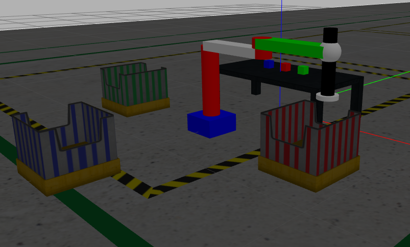

# Sociopulator- A Interactive Robot that uses Human Assistance to successfully complete tasks

**Author**: [Varun Walimbe](https://github.com/varun7860)

## About Sociopulator
Sociopulator is a manipulator designed to perform manipulation tasks like "pick and place" successfully by interacting with humans. In this project the manipulator has the task of sorting the three packages (Green,Red,Blue) in their respective bin.(Green - Green Bin, Red - Red Bin, Blue - Blue Bin). The human can give the robot any of these 3 tasks through voice command. The robot asks for feedback after completing each task given by the human. whenever the robot is not able to perfom the given task, it asks for assistance from the human. Human provides different kinds of solutions to the robot to resolve the problem faced and robot tries to complete the tasks with the help of these solutions.

The main aim of this project is to demonstrate the power of human robot interaction and human robot team.This project will show how an efficient communication between human and robot can help tacling dynamic real life environment issues faced in today's world. These real life problems are mentioned in the research question section below. We have tried to demonstrate some of these real life issues with a help of simple environment in ROS and pick-place task.

## Research Question

## Installations
ROS --Version

ROS Melodic : Ubuntu 18.04

Install ROS Controller

- `sudo apt-get update` (optional)
- `sudo apt-get upgrade` (optional)
- `sudo apt-get dist-upgrade` (optional)
- `rosdep update` (optional)
- `sudo apt-get install ros*controller*`

Install Moveit

- `sudo apt-get install moveit`

Install Communication Libraries

- `sudo apt-get install espeak`

- `pip install pyttsx3`

- `pip install python-espeak`

- `pip install SpeechRecognition`

- `sudo apt-get install pyaudio`

## How to use the package

Building the package

- `catkin build sociopulator scarapulator_control`

- `source ~/catkin_ws/devel/setup.bash`

Launching the Socioulator Robot

- `roslaunch sociopulator robot.launch`

